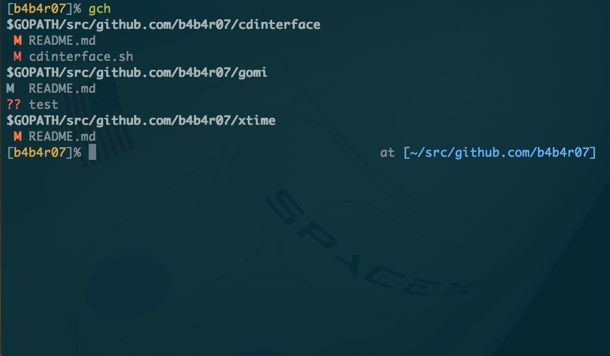

# gch - (git) Check Changes

List the changes that are applied to the repository in the `$GOPATH/src` directory.

## Description

`ghq` provides a way to organize remote repository clones, like `go get` does. However, when we are operating multiple projects, there is a disadvantage that the progress of the project in `$GOPATH` is hard to watch or check.

`gch` recursively list up a project directory in the `$GOPATH`, and get that `git status`.

*==> [`ghq`](https://github.com/motemen/ghq) + [`peco`](https://github.com/peco/peco) + [`gch`](https://github.com/b4b4r07/gch) = BEST Development Environment !*

***DEMO:***



## Requirements

- Go
- git
- (ghq)
- (peco)

## Usage

```console
$ gch
$GOPATH/src/github.com/b4b4r07/cdinterface
 M cdinterface.sh
?? .keep
$GOPATH/src/github.com/b4b4r07/gomi
 M README.md
$GOPATH/src/github.com/b4b4r07/xtime
 M README.md
```

| Simbol | Meaning |
|---|---|
| A | addition of a file |
| C | copy of a file into a new one |
| D | deletion of a file |
| M | modification of the contents or mode of a file |
| R | renaming of a file |
| T | change in the type of the file |
| U | file is unmerged (you must complete the merge before it can be committed) |
| X | "unknown" change type (most probably a bug, please report it) |
| ?? | untracked |
| ... | ... |

For more information, see `man git-diff-files`.

## Installation

	$ go get -u github.com/b4b4r07/gch

or

	$ ghq get b4b4r07/gch
	$ go install github.com/b4b4r07/gch

## License

[MIT](https://raw.githubusercontent.com/b4b4r07/dotfiles/master/doc/LICENSE-MIT.txt)

## Author

[BABAROT](http://tellme.tokyo) a.k.a. b4b4r07